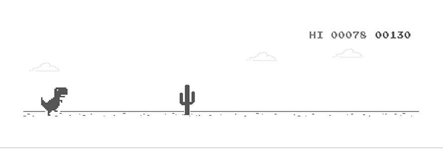

  

## klm hyeon woo

브랜딩을 좋아하는 개발자입니다 🦄

### 회고록
- [정든 멋쟁이사자처럼을 떠나며](https://klmhyeonwooo.tistory.com/89) 
- [경험의 미학](https://klmhyeonwooo.tistory.com/80) 
- [리크루팅을 위해 어플라이 사이트를 개발했다](https://klmhyeonwooo.tistory.com/74) 
- [그 동안 남의 시선에서 벗어나지 못했던 것 같다](https://klmhyeonwooo.tistory.com/65) 

### 최근 포스팅
- [v-model의 특징 및 문제점, 그리고 활용 방식](https://klmhyeonwooo.tistory.com/113) 
- [Vue3로 업데이트 되면서 어떤 부분이 변화했을까?](https://klmhyeonwooo.tistory.com/112) 
- [[rollup.js] rollup -c 실행 시, Cannot use import statement outside a module](https://klmhyeonwooo.tistory.com/109) 
- [PWA랑 Git Action을 첨가한 멋쟁이사자처럼 피드 개발기](https://klmhyeonwooo.tistory.com/108) 
- [CJS, AMD, UMD, ESM](https://klmhyeonwooo.tistory.com/107) 
